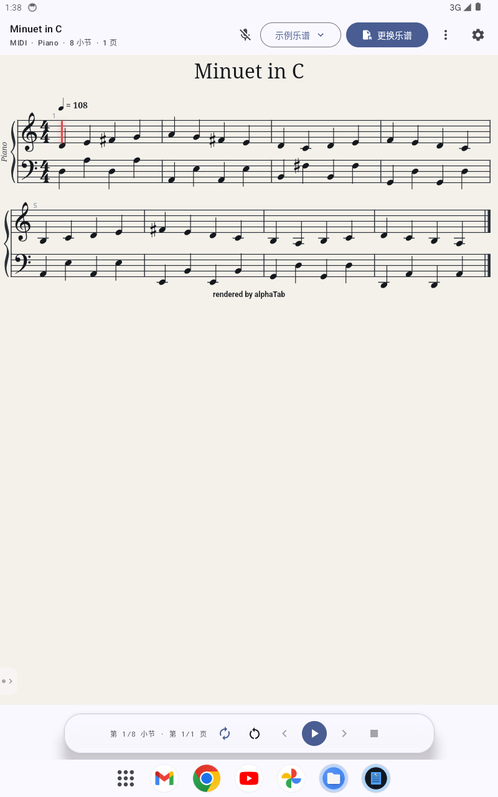
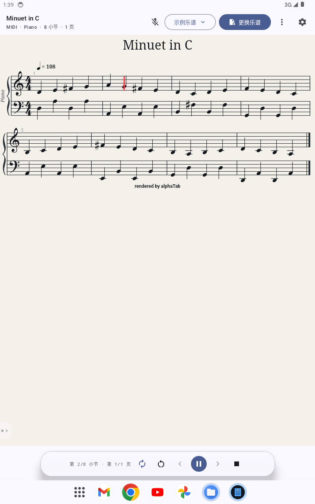
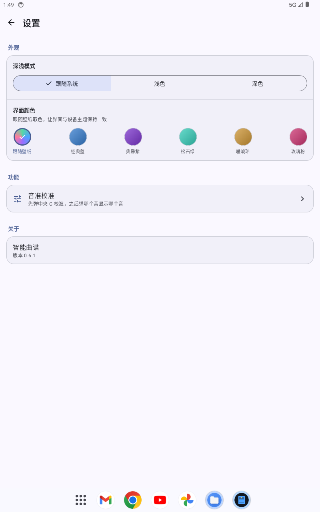
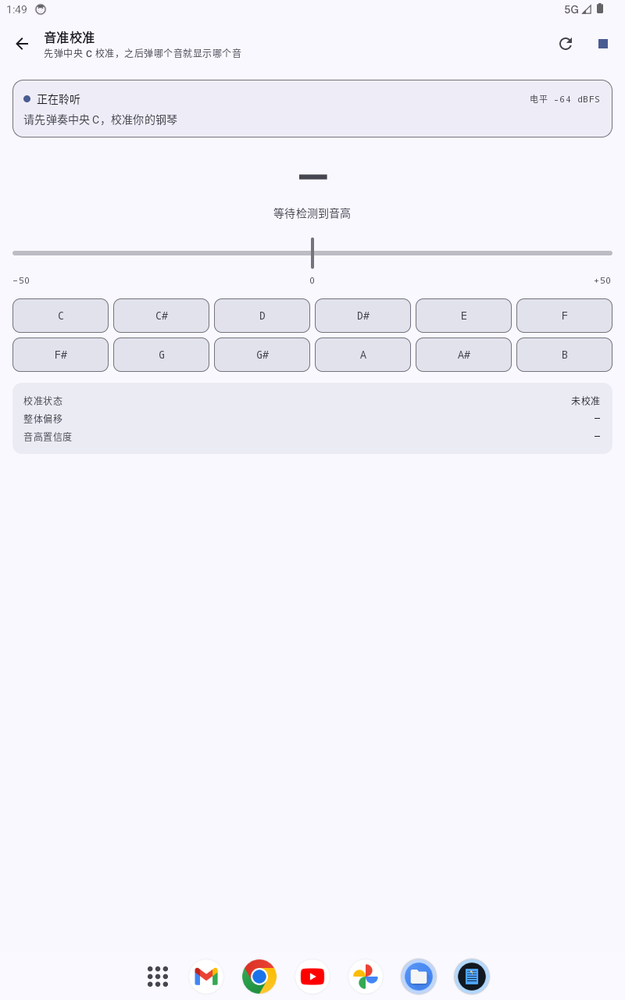

# 智能曲谱 · PianoScoreFollower

一个 Android 端的**钢琴智能曲谱**应用：导入乐谱、边弹边自动跟谱、自动翻页，并在需要时滚动谱面。

应用由三部分组成——用 Jetpack Compose 写界面，用 [alphaTab](https://www.alphatab.net/) 在 WebView 里排版与发声，用自研的 DSP 管线做音高识别与跟谱对齐。



---

## 功能特性

### 跟谱（乐谱跟随）

- **实时音高识别**：通过麦克风采集，自研 FFT 音高检测 + 色度特征提取，支持 A0–C8 全 88 键。
- **自动跟谱**：识别到的音符与谱面目标音符做匹配（余弦相似度与覆盖度等权），驱动光标前进。
- **逐行跟随**：默认逐行推进，仅当当前谱行滑出舒适区时重新锚定，避免频繁跳动。
- **自动翻页**：由置信度模型驱动，跟谱过程中自动翻到下一页。
- **跟谱面板**：默认收起，屏幕左边缘有一个半透明小箭头（带监听状态圆点）可滑出，面板内含电平表、识别音级、目标音级、匹配度与采样率等实时诊断信息。

### 播放与滚动谱

- **播放乐谱**：播放 / 暂停 / 停止，可点按谱面任意位置定位并从该处开始播放。
- **滚动谱**：支持上传 PDF 或照片（相册多选最多 60 张，或文件多选 PDF+图片），按顺序纵向排列、设定总时长后匀速滚动，可暂停与手动调速。
- **持久化**：PDF 逐页光栅化为应用私有 JPEG，页面清单、顺序、总时长与滚动位置写入本地索引；MIDI / MusicXML 同样落盘保存，重启后不丢失，并可随时删除。

### 音准校准

- 先弹**中央 C（C4）**完成基准校准，之后弹哪个音就显示哪个音，并给出音分偏差。
- 采用多次采样取中位数，降低单次误判影响。

### 外观

- **深浅模式**：跟随系统 / 浅色 / 深色。
- **界面颜色**：跟随壁纸取色，或经典蓝 / 典雅紫 / 松石绿 / 暖琥珀 / 玫瑰粉。
- 偏好持久化保存；支持竖屏与横屏，旋转时保持光标位置。

<p align="center">
  
  
  
</p>

---

## 技术栈

| 层面 | 选型 |
| --- | --- |
| 语言 / UI | Kotlin，Jetpack Compose，Material 3（`compose-bom` 2024.06.00） |
| 架构 | 单 Activity + `ViewModel` + `StateFlow`，Compose 声明式界面 |
| 乐谱排版与发声 | [alphaTab](https://www.alphatab.net/) 1.8.4，运行在 WebView 中，通过 `WebViewAssetLoader` 以 `https://appassets.androidplatform.net/` 加载本地资源 |
| 音频采集 | `AudioRecord`，使用设备实际采样率（非固定 44.1 kHz） |
| DSP | 自研 FFT（8192 点、低频加权）、色度提取、起音检测、音高检测 |
| 跟谱 | 自研 `ScoreFollower` / `FollowerEngine` / `ScoreTimeline` / `PageTurnController` |
| 文件导入 | `PickMultipleVisualMedia`（相册多选）、`OpenMultipleDocuments`（PDF + 图片） |
| PDF 处理 | `PdfRenderer` 逐页光栅化为 JPEG |
| 格式转换 | 自研 MIDI → MusicXML 转换，交由 alphaTab 排版 |
| 构建 | AGP 8.5.2，Kotlin 1.9.24，JDK 17，`compileSdk`/`targetSdk` 34，`minSdk` 29 |

---

## 项目结构

```
app/src/main/java/com/pianofollower/
├── audio/        麦克风采集、FFT、音高/色度/起音检测、校音
├── follower/     跟谱引擎、时间轴映射、自动翻页
├── image/        PDF/照片滚动谱：光栅化、页序、持久化
├── score/        乐谱模型、MIDI→MusicXML、落盘存储、内置示例
├── viewer/       WebView 宿主、资源拦截、JS 桥、事件模型
├── ui/           Compose 界面：主题、路由、跟谱/滚动谱/校音/设置
├── MainActivity.kt
└── MainViewModel.kt

app/src/main/assets/
├── scoreviewer/  内嵌乐谱页面（index.html / viewer.js / viewer.css）
├── alphatab/     alphaTab 运行时、Bravura 字体、SoundFont
└── samples/      内置示例乐谱（MIDI / MusicXML）
```

---

## 构建与运行

**环境要求**：JDK 17、Android SDK（API 34）。首次构建会自动下载 Gradle 与依赖。

```bash
# Debug 包
./gradlew :app:assembleDebug

# Release 包（需要签名配置，见下）
./gradlew :app:assembleRelease

# 单元测试
./gradlew :app:testDebugUnitTest
```

### 签名配置

Release 构建读取项目根目录的 `keystore.properties`：

```properties
storeFile=release.keystore
storePassword=<your-store-password>
keyAlias=<your-key-alias>
keyPassword=<your-key-password>
```

该文件与 `release.keystore` 已被 `.gitignore` 排除，**请勿提交**。缺少该文件时 Release 构建会跳过签名（仍可产出未签名 APK）。

### 关于 `gradle.properties`

其中 `org.gradle.java.home` 指向本机的 JDK 路径（`C:\Android\tools\jdk-17.0.2`）。若你的 JDK 装在别处，请改成自己的路径，或删掉该行并设置 `JAVA_HOME`。

---

## 安装

最新 APK 见 [Releases](https://github.com/Jimmy-xuzimo/PianoScoreFollower/releases/latest) 页面的附件。

> 音高识别依赖真实麦克风输入，**建议在真机上测试**。模拟器的音频通路与采样率往往不真实，识别结果仅供参考。

---

## 已知限制

- 首次安装后的第一次冷启动需要初始化 WebView 与解码 9.5 MB 的采样钢琴音源，耗时较长（模拟器上可达十余秒），之后启动会明显加快。加载期间界面会显示「音源加载中…」，超时后提供重试。
- 模拟器使用软件/低性能 GPU 渲染时，WebView 排版可能掉帧甚至触发 ANR，属环境问题，真机正常。
- 音源解码与首次渲染在部分低配设备上可能需要数秒，请以真机实测为准。

---

## 第三方资源与许可

本项目源码以 BSD 3-Clause 发布，但 `app/src/main/assets/` 下包含的第三方资源遵循各自的许可证：

| 资源 | 许可证 | 说明 |
| --- | --- | --- |
| [alphaTab](https://www.alphatab.net/) 1.8.4 | Mozilla Public License 2.0 | 乐谱排版与音频合成运行时，内含 TinySoundFont 等集成库 |
| [Bravura](https://github.com/steinbergmedia/bravura) 字体 | SIL Open Font License 1.1 | 乐谱字形，许可证见 `assets/alphatab/font/Bravura-OFL.txt` |
| `piano.sf2` 采样音源 | CC0 / 公共领域 | 真实钢琴采样 SoundFont |
| `sonivox.sf2` | 随 alphaTab 分发的通用 MIDI 音源 | 备用音源 |

再分发时请一并保留上述许可证与署名信息。

---

## 许可证

[BSD 3-Clause](LICENSE) © 2026 Jimmy-xuzimo
